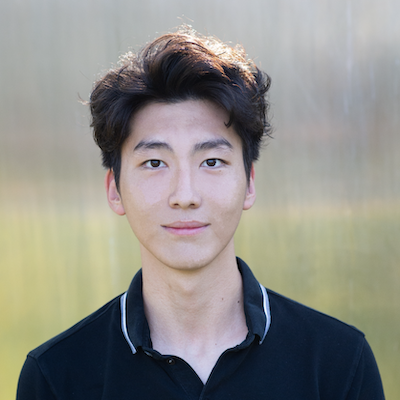

## Welcome to Jianming Geng's Homepage!

#### Background 
I am a fourth year undergraduate student majoring in Applied Math and Data Science at UCSD. I went to high school at Shipley (Philadelphia). My favorite quote is 
> People change. Now I am a salamander. 

#### About My Life
***My Hobbies***
- Play Tennis
- Texas Holdem
- Sleep

***Favorite Tennis Player***
1. Nadal
2. Danny Medvedev
3. Djokovic

#### Favorite Site
[Click with incognito browser and private network ;)](https://www.youtube.com/watch?v=dQw4w9WgXcQ&ab_channel=RickAstley)

#### Favorite Language
*Python*

#### Favorite Line of Code
`ls -l`

#### Goal of My Undergrad Study
- [x] Get first place on any Kaggle
- [ ] Become a master of coding
- [ ] Learn as much as I can :tada:

#### Recursion (Kind of)
[Back to Main Page](README.md)

